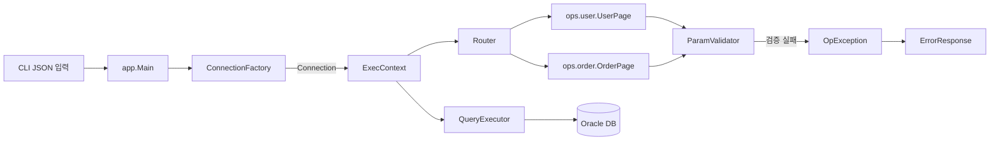
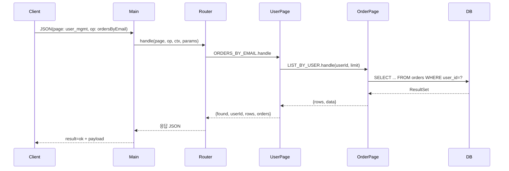

# Web Connector Architecture

간단한 요청 처리 흐름과 주요 구성 요소를 머메이드 다이어그램으로 정리했습니다. JSON 입력을 받아 Oracle DB와 연동하는 작은 라우터 기반 애플리케이션의 구조를 한눈에 파악할 수 있습니다.

## 상위 구조

* **Main**: JSON 문자열을 인자로 받아 페이지와 오퍼레이션을 꺼내고, DB 설정으로 `Connection`을 생성한 뒤 라우터에 전달합니다.
* **Router**: `page`와 `op` 조합으로 정해진 핸들러(`ops.user.UserPage`, `ops.order.OrderPage`)를 호출합니다.
* **ExecContext**: DB 커넥션과 `QueryExecutor`를 묶어 핸들러들이 사용할 수 있게 제공합니다.
* **ParamValidator** / **OpException** / **ErrorResponse**: 입력 검증 및 오류 응답 경로를 담당합니다.

## 사용자 주문 조회 시퀀스

이 다이어그램은 이메일로 사용자를 찾고 해당 사용자의 주문 목록을 반환하는 흐름을 보여줍니다. 각 단계에서 `ParamValidator`가 필수 파라미터를 확인하고, SQL 오류나 검증 실패는 `OpException`을 통해 표준화된 `ErrorResponse`로 직렬화됩니다.
