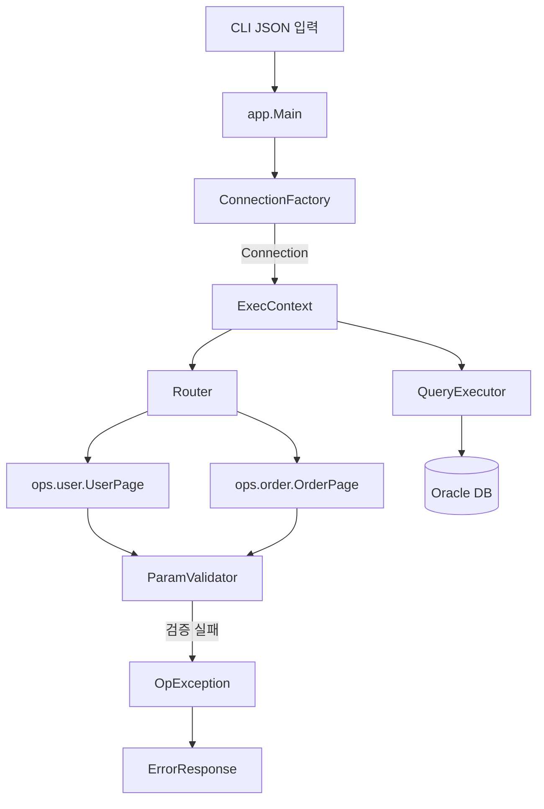

```mermaid
flowchart TD
    Client[CLI JSON 입력] --> Main[app.Main]
    Main --> ConnectionFactory
    ConnectionFactory -->|Connection| ExecContext
    ExecContext --> Router
    Router --> UserPage[ops.user.UserPage]
    Router --> OrderPage[ops.order.OrderPage]
    UserPage --> ParamValidator
    OrderPage --> ParamValidator
    ParamValidator -->|검증 실패| OpException
    OpException --> ErrorResponse
    ExecContext --> QueryExecutor
    QueryExecutor --> DB[(Oracle DB)]
```
